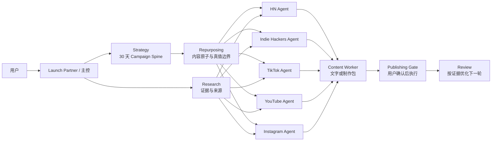

# NowBuild 多渠道内容扩展方案

更新日期：2026-07-26

## 结论

HN、Indie Hackers 是社区文字渠道；TikTok、YouTube 是视频渠道；Instagram 是以视觉内容为核心、同时覆盖 Reels 的混合渠道。NowBuild 当前最适合先交付“内容生产方案”，而不是承诺自动完成所有拍摄与设计：

- 社区渠道：可直接审核和发布的帖子、首评与回复预案。
- 短视频：Hook、逐字口播稿、分镜、画面与字幕、剪辑说明和测试方案。
- YouTube：Shorts 或长视频的标题/缩略图概念、章节、旁白、演示镜头和复用切片。
- Instagram：Carousel 逐页文案、Meme 概念、Reels 脚本、Stories 序列和美术 brief。

产品定位因此从“多平台文案生成”升级为：

> 一个主控 Agent 管理同一套 30 天增长叙事；每个渠道 Agent 使用自己的 Skill，把已验证的内容原子转成该平台原生、可执行的内容或制作包。

## 一、渠道方法研究

### Hacker News

适合：产品已经可以让读者实际尝试，且有技术、产品取舍或新颖实现可讲。

方法：

- Show HN 必须指向可尝试的作品；注册、邮件收集或下载障碍越少越好。
- 标题和首条评论讲清楚做了什么、为什么做、关键技术/产品取舍和已知限制。
- 不组织朋友点赞或评论，不用营销口号代替技术细节。
- 发布前准备事实核对、常见质疑和创始人回复预案。

来源：[Show HN 官方指南](https://news.ycombinator.com/showhn.html)

### Indie Hackers

适合：创始人决策、Build Log、增长实验、里程碑复盘和具体反馈请求。

方法：

- 使用“假设—行动—观察—解释—下一步”的实验结构。
- 展示真实约束、失败和未知，不虚构收入、用户或个人经历。
- 产品只在理解故事所必需的位置出现。
- 把 builder 信任和客户获取分开评估；其他创业者的关注不等于目标客户需求。

社区证据：[Build in public audience is not your market](https://www.indiehackers.com/post/your-build-in-public-audience-is-not-your-market-i-learned-the-difference-the-slow-way-2cbea1089d)、[Turn build-in-public content into customer interest](https://www.indiehackers.com/post/how-to-turn-built-in-public-content-into-real-customer-interest-afrdRUcA1M5MOR5YDnAA)

### TikTok / Reels / Shorts

适合：可视化产品结果、创始人口播、屏幕演示、问题/解决方案和短教程。

方法：

- 开头第一段同时设计画面 Hook、口播 Hook 和文字 Hook。
- 用“开头—主体—结尾”组织内容；开头尽快明确问题、结果或张力。
- 每条只讲一个核心观点；口语句子要短，并为每个语义节拍匹配镜头或屏幕动作。
- 输出至少两个只改变开头的测试版本。
- 用留存、完播、分享/收藏和合格行动判断，而不是只看播放量。

来源：[TikTok Creative Center](https://ads.tiktok.com/help/article/creative-center)、[TikTok 创意脚本建议](https://ads.tiktok.com/business/creativecenter/quicktok/online/creative-tips-for-home-and-lifestyle/pc/en)、[YouTube Shorts 创建建议](https://support.google.com/youtube/answer/12921536?co=GENIE.Platform%3DDesktop&hl=en)、[YouTube Shorts 分析建议](https://support.google.com/youtube/answer/12942217?co=YOUTUBE._YTVideoType%3Dshorts&hl=en-GB)

### YouTube 长视频

适合：搜索型教程、产品演示、深度解释、技术取舍和可持续沉淀的内容。

方法：

- 先定义一个明确的观看承诺，再让标题、缩略图、开头和结论保持一致。
- 教程需完整解决一个搜索意图；产品演示要展示结果、过程、限制和适用人群。
- 用章节、真实 UI、屏幕动作和证据支撑旁白。
- 从长视频切出可独立理解的 Shorts，而不是简单截取没有上下文的片段。
- 采用可持续的制作节奏，优先批量录制和复用。

来源：[YouTube Shorts 发布节奏建议](https://support.google.com/youtube/answer/13616979?co=YOUTUBE._YTVideoType%3Dshorts&hl=en)、[YouTube Shorts 发现机制](https://support.google.com/youtube/answer/10059070/get-started-with-youtube-shorts?hl=en-GB)

### Instagram 视觉内容

适合：可保存的 Carousel、产品演示轮播、原生 Meme、Reels 和 Stories。

方法：

- Carousel 的封面单独承担停止滚动的任务；内部每页一个观点，保持一个视觉系统。
- 产品 Walkthrough 先展示结果和步骤总览，再逐页展示真实截图。
- Meme 从目标用户真实处境出发，用原创或有授权的模板，不复制他人的完整创意。
- Reels 使用竖屏、音频和安全区内的关键信息；视觉 brief 必须包含字幕、封面和可访问性文本。
- 用收藏、分享、轮播完成度、回复和合格主页行动评估。

来源：[Instagram Best Practices](https://about.fb.com/news/2024/10/best-practices-education-hub-creators-instagram/amp/)、[Instagram 内容创作与留存工具](https://about.fb.com/news/2023/11/new-ways-to-create-content-on-instagram/)、[Meta Reels 创意建议](https://www.facebook.com/business/ads/facebook-instagram-reels-ads)

## 二、Skill 采集与评估

安装并保留上游原件：

| Skill | 评分 | 决策 | 适合部分 | 不直接采用的部分 |
| --- | ---: | --- | --- | --- |
| `external/social` | 92/100 | 策略层使用，运行时适配 | 内容原子复用、短视频脚本、Carousel 结构 | 固定频率/发布时间和无一手证据的效果百分比 |
| `external/video` | 86/100 | 策略层使用，运行时适配 | 制作包、beat sheet、工具选择、原创性约束 | 会变化的供应商能力/价格，以及未连接工具时的自动渲染承诺 |

来源仓库：[coreyhaines31/marketingskills](https://github.com/coreyhaines31/marketingskills)，审计 commit `c21a984a56da10fb6085e6334f6f60929220a4da`，MIT。

新增运行时 Skill：

- `custom/creative-atom-repurposing`
- `custom/indie-hackers`
- `custom/short-video-script`
- `custom/youtube-video`
- `custom/instagram-visual`

所有渠道继续共同挂载：

- `custom/research-grounded-writing`
- `custom/authentic-editorial-voice`
- `custom/creative-atom-repurposing`

这保证搜索不是只在初始化阶段使用：每次渠道内容生成都会尝试获取新证据；搜索不可用时，Agent 必须降低主张强度，不能补造统计、案例、经历或引用。

## 三、NowBuild 的 30 天冷启动方案

原则：不要在第一天同时运营十个平台。先从一个真实内容原子生成不同生产包，再用信号决定加码渠道。

### Week 1：建立证据和可复用母体

- 固化产品定位、受众、核心问题和可验证 proof。
- 建立 3 个内容原子：创始人决策、可见的产品结果、一个用户问题。
- 准备 1 篇 Indie Hackers 创始人/实验帖。
- 做 HN readiness audit；产品不可直接体验时不安排 Show HN。
- 生成 3 个短视频制作包、1 个 Instagram Carousel 制作包。
- 为所有外部主张记录来源和待验证项。

### Week 2：低成本格式测试

- TikTok：录制/发布 3 条原生短视频，优先屏幕演示和真人口播。
- YouTube：发布 2 条 Shorts，复用同一内容原子但改写开头、标题和观看承诺。
- Instagram：发布 1 组 Carousel + 1 条 Reel 或 Meme。
- Indie Hackers：发布 1 篇有具体问题的 Build Log 或实验报告。
- 只改一个变量进行 Hook 或格式测试。

### Week 3：把赢家做深

- 从表现最好的短内容扩展 1 个 YouTube 长视频制作包。
- 把高收藏/高回复主题写成更完整的教程或产品演示。
- 若产品已可体验且技术故事成立，准备 Show HN 提交包与回复预案。
- 将长视频或深度内容拆成新的 Shorts、Reels、Carousel 和社区讨论，而不是复制原稿。

### Week 4：复盘与第二轮

- 按渠道比较高/低表现内容，记录 Hook、结构、主题和 CTA 的差异。
- 重做 2 个赢家，淘汰 1 个无信号格式。
- 汇总常见评论和异议，形成下一轮内容原子。
- 对 HN、Indie Hackers、TikTok、YouTube、Instagram 分别给出继续、降频或暂停建议。
- 产出下一周期的 7 天明确任务和 Day 8–30 骨架。

建议的轻量节奏：

| 渠道 | 30 天交付 |
| --- | --- |
| Hacker News | 1 次 readiness audit；条件满足时 1 个 Show HN 提交包 |
| Indie Hackers | 4 篇创始人/实验/Build Log 草稿 |
| TikTok | 9–12 个短视频制作包 |
| YouTube | 4–6 个 Shorts 制作包；1 个长视频制作包 |
| Instagram | 4 个 Carousel/Meme；4 个 Reels/Stories 制作包 |

## 四、Agent 架构修改

关键修改：

1. 渠道注册表不再只有名字和 Skill，而是包含 `medium`、`outputMode` 和 `deliverables`。
2. 新增 Repurposing 角色，对应现有 Topic Planner：它拥有内容原子和跨渠道变体，不拥有最终发布。
3. 主控只负责意图、范围、路由和确认；不会把所有渠道 Skill 塞进一个 Prompt。
4. Strategy Agent 渐进式读取上游方法论；每个 Channel Agent 由 `channelId` 确定性挂载自己的运行时 Skill。
5. Content Worker 根据输出合同交付 `publish_ready_text`、`production_package` 或 `operational_plan`。
6. 每一次渠道内容生成都经过 Research；无证据时进入 no-invention 模式。
7. 拍摄、设计、登录、发布、付款等外部动作继续经过 Publishing Gate 和用户确认。

这套结构允许以后增加新的图像生成或视频渲染工具，而不需要重写策略层：只要在制作包后增加可验证的 Renderer，并在输出实际文件后更新状态即可。
